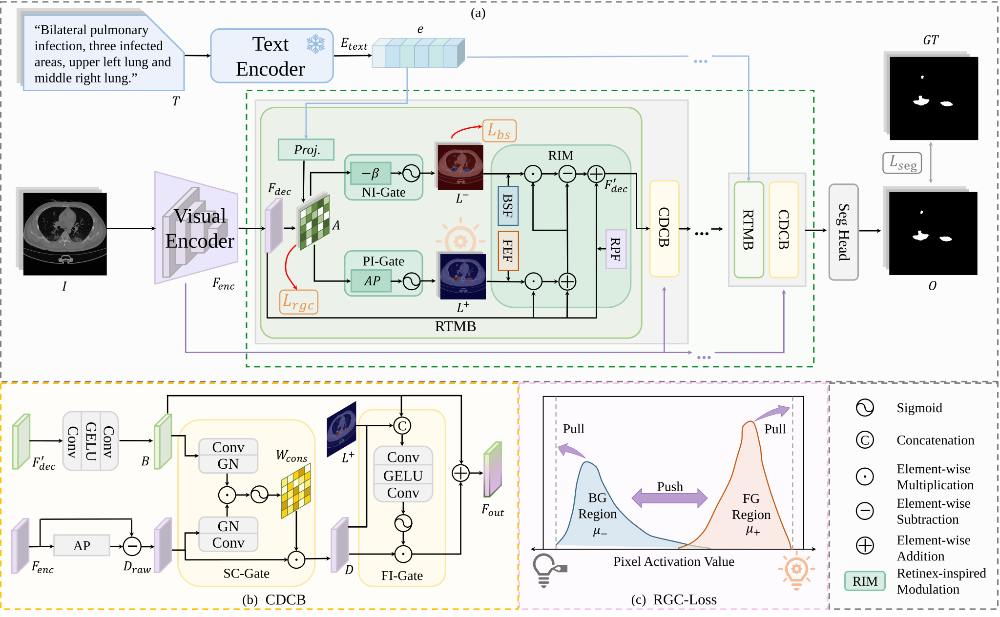
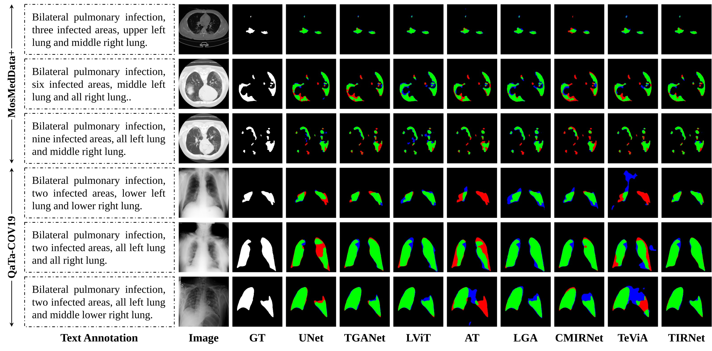
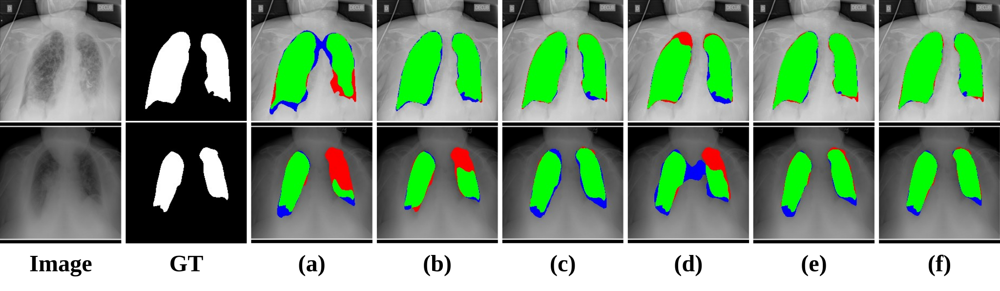

<h1 align="center">Text as Illumination: Spatial Contrastive Retinex Learning<br>for Language-guided Medical Image Segmentation</h1>

<p align="center">
    
</p>
<p align="center" style="font-size: 18px; color: gray;">
    Figure 1: Overview of the TIRNet. It integrates RTMB and CDCB into each decoder stage. The RGC-Loss maximizes cross-modal similarity in text-relevant foregrounds and suppresses background activations to enlarge the foreground-background margin.
</p>

**TIRNet** is a novel Retinex-inspired framework for Language-guided Medical Image Segmentation (LMIS). By treating clinical text embeddings as semantic illumination fields, TIRNet explicitly disentangles target foregrounds from visually similar backgrounds, addressing the semantic mismatch inherent in cross-modal interaction. Specifically, the Retinex-inspired Text Modulation Block (RTMB) derives complementary positive and negative illumination maps to amplify text-relevant features and suppress background interference, while the Consistent Detail Compensation Block (CDCB) selectively recovers high-frequency details via an illumination-guided consistency gate. Furthermore, Multi-Scale Illumination Supervision Loss (MSIS-Loss), comprising a Region-Grounded Contrastive Loss (RGC-Loss) and a Background Suppression Loss (BS-Loss), jointly ensures precise cross-modal alignment at each decoder stage. Extensive experiments on the MosMedData+ and QaTa-COV19 datasets demonstrate that TIRNet achieves state-of-the-art performance in LMIS.

---

## Table of Contents 📑

- [Introduction](#introduction)
- [Contributions](#contributions)
- [Experimental Results](#experimental-results)
- [Ablation Studies](#ablation-studies)
- [Visualizations](#visualizations)
- [Reproduction](#reproduction)


---

## **Introduction** 🌟

Language-guided Medical Image Segmentation (LMIS) has shown great potential to improve the delineation of anatomical structures and lesions by integrating clinical textual information. Existing methods generally rely on either implicit interaction between textual and visual features or auxiliary coarse-grained supervision for cross-modal alignment. However, these methods lack explicit and fine-grained constraints to ensure semantic consistency, causing a mismatch between language and the segmentation outputs.

To address this issue, we propose Text-as-Illumination Retinex Network (TIRNet), a novel Retinex-inspired framework that treats text embeddings as semantic illumination for feature modulation, thereby improving semantic consistency in LMIS. TIRNet introduces two key blocks integrated at each decoder stage: (1) the RTMB, which employs positive and negative illumination maps to enhance text-relevant foreground features and suppress background interference; and (2) the CDCB, which selectively recovers high-frequency details via a consistency-gated mechanism conditioned on illumination reliability. Furthermore, MSIS-Loss, comprising a Region-Grounded Contrastive Loss (RGC-Loss) and a Background Suppression Loss (BS-Loss), jointly ensures precise cross-modal alignment at each decoder stage.

---

## **Contributions**

**1.** We propose TIRNet, which draws inspiration from Retinex theory by treating text embeddings as semantic illumination, enabling explicit foreground amplification and background suppression in decoder features.

**2.** We design the RTMB to derive complementary illumination maps for feature modulation, and the CDCB to selectively recover high-frequency details via an illumination-guided consistency gate.

**3.** We introduce MSIS-Loss, combining RGC-Loss and BS-Loss, to enforce cross-modal semantic alignment across all decoder stages.

**4.** Experiments on the MosMedData+ and QaTa-COV19 datasets demonstrate that TIRNet achieves superior performance over existing methods.

---

## **Experimental Results**

### Quantitative Comparison on MosMedData+ and QaTa-COV19

| Method | Params (M) | Flops (G) | MosMedData+ m-Dice | MosMedData+ m-IoU | MosMedData+ g-Dice | MosMedData+ g-IoU | QaTa-COV19 m-Dice | QaTa-COV19 m-IoU | QaTa-COV19 g-Dice | QaTa-COV19 g-IoU |
|--------|-----------|-----------|-------------------|------------------|-------------------|------------------|------------------|-----------------|------------------|-----------------|
| U-Net | 14.80 | 50.3 | 62.52 | 49.24 | 72.38 | 56.71 | 78.46 | 68.59 | 86.66 | 76.47 |
| U-Net++ | 74.50 | 94.6 | 69.74 | 57.39 | 80.19 | 66.93 | 79.55 | 70.21 | 87.76 | 78.19 |
| nnUNet | 19.10 | 412.7 | 73.18 | 61.02 | 80.46 | 67.31 | 79.13 | 69.69 | 87.37 | 77.57 |
| Swin-UNet | 82.30 | 67.3 | 65.94 | 52.35 | 77.85 | 63.73 | 77.29 | 67.55 | 86.44 | 76.12 |
| GLoRIA | 45.60 | 60.8 | 70.11 | 56.75 | 79.31 | 65.71 | 79.51 | 70.36 | 88.25 | 78.97 |
| LAVT | 118.60 | 83.8 | 73.66 | 60.74 | 80.66 | 67.58 | 78.87 | 69.35 | 87.56 | 77.88 |
| TGANet | 19.80 | 41.9 | 70.73 | 57.90 | 80.06 | 66.75 | 80.41 | 71.24 | 88.45 | 79.29 |
| LViT | 29.70 | 54.1 | 74.52 | 61.15 | 76.64 | 62.12 | 83.40 | 74.78 | 90.63 | 82.86 |
| LGA | 8.24 | 381.1 | 74.53 | 61.10 | 80.55 | 67.43 | 83.46 | 74.50 | 89.85 | 81.56 |
| CMIRNet | 239.80 | 134.5 | 73.88 | 60.25 | 79.64 | 66.17 | 79.63 | 69.87 | 87.45 | 77.71 |
| AT | 44.00 | 22.4 | 72.41 | 58.63 | 78.53 | 64.65 | 79.57 | 69.48 | 87.19 | 77.30 |
| TeViA | 146.80 | 11.2 | 72.32 | 59.06 | 79.47 | 65.94 | 84.12 | 75.69 | 90.96 | 83.41 |
| **TIRNet (Ours)** | 41.10 | 24.1 | **75.41** | **62.77** | **81.38** | **68.61** | **84.77** | **76.47** | **91.23** | **83.88** |

---

## **Ablation Studies**

### Component Ablation (QaTa-COV19)

| RTMB | CDCB | MSIS-Loss | m-Dice | m-IoU | g-Dice | g-IoU |
|:---:|:---:|:---:|------:|------:|------:|------:|
| ✗ | ✗ | ✗ | 78.44 | 68.67 | 86.90 | 76.83 |
| ✓ | ✗ | ✗ | 83.13 | 74.45 | 90.48 | 82.61 |
| ✓ | ✗ | ✓ | 83.65 | 75.08 | 90.72 | 83.02 |
| ✗ | ✓ | ✗ | 79.97 | 70.53 | 87.71 | 78.11 |
| ✓ | ✓ | ✗ | 84.36 | 75.96 | 91.13 | 83.70 |
| ✓ | ✓ | ✓ | **84.77** | **76.47** | **91.23** | **83.88** |

### Hyperparameter Sensitivity (λ_rgc / λ_bs)

| λ_rgc / λ_bs | m-Dice | m-IoU | g-Dice | g-IoU |
|:---:|------:|------:|------:|------:|
| 0 / 0 | 84.36 | 75.96 | 91.13 | 83.70 |
| 1 / 0 | 84.54 | 76.11 | 91.16 | 83.75 |
| 0 / 0.5 | 84.20 | 75.81 | 91.22 | 83.85 |
| 0.5 / 0.5 | 84.35 | 75.96 | 91.10 | 83.65 |
| 1 / 1 | 84.39 | 75.94 | 91.04 | 83.55 |
| **1 / 0.5** | **84.77** | **76.47** | **91.23** | **83.88** |

---

## **Visualizations**

### Qualitative Comparison with Different Methods

<p align="center">
    
</p>
<p align="center" style="font-size: 18px; color: gray;">
    Figure 2: Visual comparison of segmentation results of different methods (Green: True Positive, Red: False Negative, Blue: False Positive).
</p>

### Ablation Study Visualization

<p align="center">
    
</p>
<p align="center" style="font-size: 18px; color: gray;">
    Figure 3: Qualitative visualization of the component ablation study. Panels (a)--(f) correspond to the methods in rows 1--6 of the component ablation table, respectively.
</p>

---

## **Reproduction**

### Environment Setup

```bash
conda env create -f environment.yml
conda activate tirnet
```

Or install dependencies manually:

```bash
conda create -n tirnet python=3.10 -y
conda activate tirnet
pip install -r requirements.txt
```

Download [ViT-B/32.pt](https://openaipublic.azureedge.net/clip/models/40d365715913c9da98579312b702a82c18be219cc2a73407c4526f58eba950af/ViT-B-32.pt) and place it under `pretrained/`.

### Datasets

You can refer to [LViT](https://github.com/HUANGLIZI/LViT) to download the dataset.

Place or symlink data under `datasets/`:

```
datasets/QaTa-COV19-v2/{Train_Folder,Val_Folder,Test_Folder}
datasets/MosMedData+Dataset/{Train_Folder,Val_Folder,Test_Folder}
```

Each folder requires `img/`, `labelcol/`, and the corresponding `*_text.xlsx`.

### Training

```bash
python train_model.py --cfg_path config_qata --gpu 0
python train_model.py --cfg_path config_mosmed --gpu 0
```

Outputs are saved under `outputs/<dataset>/TIRNet/session_*/`.

### Testing

```bash
# Test a specific training session
python test_model.py --cfg_path config_qata --test_session <session_name> --gpu 0

# Test with a specific model checkpoint
python test_model.py --cfg_path config_qata --model_path outputs/QaTa/TIRNet/<session>/models/best_model-TIRNet.pth.tar --gpu 0
```

Reports four foreground metrics: mean per-image Dice/IoU and global pixel Dice/IoU.

---

## **Citation**

If you find TIRNet helpful in your research, please consider citing:

```bibtex
@misc{shi2026textilluminationspatialcontrastive,
      title={Text as Illumination: Spatial Contrastive Retinex Learning for Language-guided Medical Image Segmentation}, 
      author={Jian Shi and Cheng Zhen and Pingping Zhang and Rui Xu and Yanan Lv and Yili Ma and Huan Bi and Haojie Li and Huchuan Lu},
      year={2026},
      eprint={2606.27794},
      archivePrefix={arXiv},
      primaryClass={cs.CV},
      url={https://arxiv.org/abs/2606.27794}, 
}
```

## **Acknowledgement**

Thanks to the open-source of the following projects:
[ShawnHuang497/RecLMIS](https://github.com/ShawnHuang497/RecLMIS)


